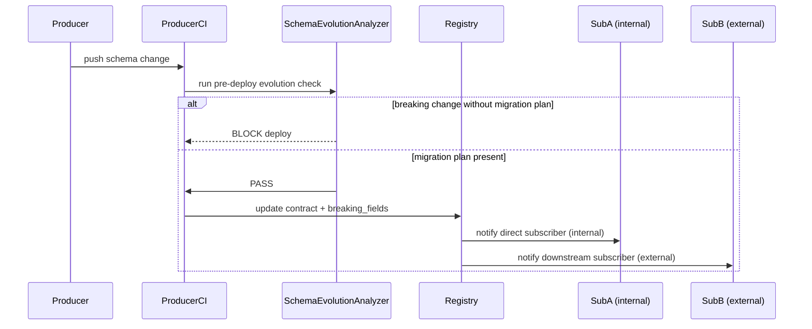

# DOMAIN_NOTES

## Q1. What is the system boundary?

The Week 7 system is the enforcement boundary for multiple upstream producers:
Week 3 document extraction, Week 4 lineage, Week 5 event streaming, and LangSmith traces.
Week 7 does not own those producers; it consumes their outputs, profiles them, and enforces data contracts at the interface.

## Q2. Why use contracts instead of only runtime checks?

Runtime checks tell us what happened after the data already crossed the boundary.
Contracts make the invariants explicit before downstream consumers depend on them.
That matters most when a field is technically present but semantically unsafe, such as a drifting confidence score, a broken ordering field, or a missing lineage link.

## Q3. What is the trust boundary sequence?

The registry sits between producer CI and downstream consumers.
The SchemaEvolutionAnalyzer is the producer-side gate: a breaking change without a migration plan registered first blocks the deploy.
Blast radius is therefore declared and governed before the change ships, then enriched by lineage evidence — not inferred from lineage after the fact.

## Q4. What changed in the new registry-first design?

The new design makes `contract_registry/subscriptions.yaml` the source of truth for direct subscribers.
Lineage is still useful, but only as enrichment:
it helps explain how contamination could spread, not who is contractually affected.
This reduces ambiguity when the lineage graph is incomplete, stale, or noisy.

## Q5. What kind of failure does the violation injection represent?

The root failure is a process failure, not a technical one.

The `confidence` field changed from a probability (0–1) to a percentage (0–100) without any corresponding update to the contract or the registry subscription. The range check and the drift check both fire — but that is the *detection* working. The failure itself happened earlier: there was no process that required the producer to update `subscriptions.yaml` before shipping the schema change. Because no such gate existed, the contract went stale silently, and downstream consumers (Week 4 lineage quality checks) would have acted on confidence semantics that no longer matched reality.

The technical checks are a safety net. The process failure is the absence of a rule that makes registry updates mandatory when schemas change — the same gap that the SchemaEvolutionAnalyzer CI gate is designed to close.

