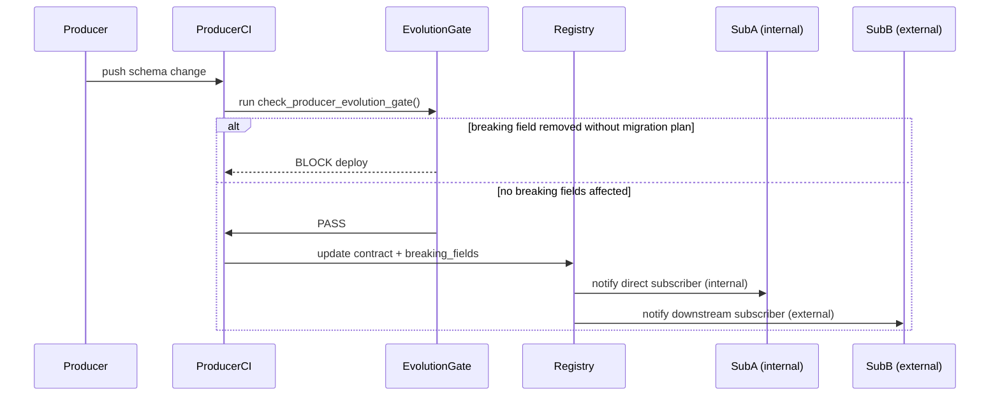

# DOMAIN_NOTES

## Q1. What is the system boundary?

The Week 7 system enforces contracts for the following upstream producers:

| Producer | Contract ID | Coverage |
|---|---|---|
| Week 3 — Document Refinery | `week3-document-refinery-extractions` | Active — source data present |
| Week 4 — Cartographer | `week4-lineage-graph` | Active — source data present |
| Week 5 — Event Store | `week5-event-store` | Active — source data present |
| Week 1 — Intent Correlator | `week1-intent-correlator` | **Out of scope** — no source data in repo |
| Week 2 — Digital Courtroom | `week2-digital-courtroom` | **Out of scope** — no source data in repo |
| LangSmith traces | `langsmith-traces` | **Out of scope** — external system, no local data |

Week 7 does not own these producers; it consumes their outputs, profiles them, and enforces contracts at the interface.
Week 1, Week 2, and LangSmith are declared in the registry catalog but marked `out_of_scope` because no source data is available locally.
Claiming coverage for those systems without source data would be misleading.

## Q2. Why use contracts instead of only runtime checks?

Runtime checks tell us what happened after the data already crossed the boundary.
Contracts make the invariants explicit before downstream consumers depend on them.
That matters most when a field is technically present but semantically unsafe, such as a drifting confidence score, a broken ordering field, or a missing lineage link.

## Q3. What is the trust boundary sequence?

The registry sits between producer CI and downstream consumers.
`check_producer_evolution_gate()` (in `contracts/runner.py`) is the producer-side gate:
a breaking change without a migration plan registered first blocks the deploy.
Blast radius is therefore declared and governed before the change ships,
then enriched by lineage evidence — not inferred from lineage after the fact.

## Q4. What changed in the new registry-first design?

The registry (`contract_registry/subscriptions.yaml`) now has three sections:

1. **`registry`** — metadata, including the `schema_evolution_policy` that declares the gate is producer-side and action on breaking change is `block`.
2. **`contracts`** — the full catalog of every contract (active and out-of-scope), with the reason why out-of-scope contracts are excluded.
3. **`subscriptions`** — the declared dependency graph: who subscribes to which contract and which fields are breaking.

Previously, the registry only had a flat `subscriptions` list.  The new design makes it the authoritative record for:
- which contracts exist and their status
- which downstream systems are affected by a change (blast-radius source of truth)
- what the schema-evolution policy is

Lineage is still useful, but only as enrichment:
it helps explain how contamination could spread, not who is contractually affected.

## Q5. What kind of failure does the violation injection represent?

The root failure is a process failure, not a technical one.

The `confidence` field changed from a probability (0–1) to a percentage (0–100) without any corresponding update to the contract or the registry subscription. The range check and the drift check both fire — but that is the *detection* working. The failure itself happened earlier: there was no process that required the producer to update `subscriptions.yaml` before shipping the schema change. Because no such gate existed, the contract went stale silently, and downstream consumers (Week 4 lineage quality checks) would have acted on confidence semantics that no longer matched reality.

The technical checks are a safety net. The process failure is the absence of a rule that makes registry updates mandatory when schemas change — the same gap that `check_producer_evolution_gate()` is designed to close.
