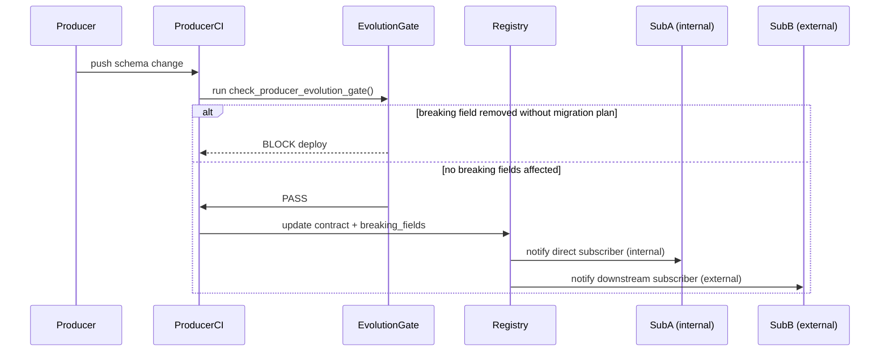

# DOMAIN_NOTES

## Q1. What is the system boundary?

The Week 7 system enforces contracts for the following upstream producers:

| Producer | Contract ID | Coverage |
|---|---|---|
| Week 3 — Document Refinery | `week3-document-refinery-extractions` | Active — source data present |
| Week 4 — Cartographer | `week4-lineage-graph` | Active — source data present |
| Week 5 — Event Store | `week5-event-store` | Active — source data present |
| LangSmith traces | `langsmith-traces` | Active — 22 trace nodes exported locally |
| Week 1 — Intent Correlator | `week1-intent-correlator` | Out of scope — no source data in repo |
| Week 2 — Digital Courtroom | `week2-digital-courtroom` | Out of scope — Week 2 is covered indirectly via `langsmith-traces` |

Week 7 does not own these producers; it consumes their outputs, profiles them, and enforces contracts at the interface.
Week 1 and Week 2 are declared in the registry catalog with `status: out_of_scope`.
LangSmith trace data is available locally at `outputs/traces/` and is actively contracted and validated.

The system validates 4 active contracts covering 159 checks total, all passing as of 2026-04-03.

---

## Q2. Why use contracts instead of only runtime checks?

Runtime checks tell us what happened after the data already crossed the boundary.
Contracts make the invariants explicit before downstream consumers depend on them.
That matters most when a field is technically present but semantically unsafe — a drifting confidence score, a broken ordering field, or a missing lineage link.

There are three specific failure modes that contracts catch before runtime does:

1. **Silent semantic drift** — the `confidence` field stays present as a float, but the scale shifts from `[0.0, 1.0]` to `[0–100]`. A runtime null check passes. The contract's range rule fails.
2. **Blast-radius ignorance** — a producer removes a field they think is unused. Without a subscription registry, no one knows who breaks until the downstream pipeline fails.
3. **Schema evolution without coordination** — a new required field is added. Existing producers silently omit it. The contract's `required: true` check fires immediately; a runtime check fires days later when the batch job runs.

---

## Q3. What is the trust boundary sequence?



The registry sits between producer CI and downstream consumers.
`check_producer_evolution_gate()` (in `contracts/runner.py`) is the producer-side gate:
a breaking change without a migration plan registered first blocks the deploy.
Blast radius is therefore declared and governed before the change ships,
then enriched by lineage evidence — not inferred from lineage after the fact.

---

## Q4. What changed in the new registry-first design?

The registry (`contract_registry/subscriptions.yaml`) has three sections:

1. **`registry`** — metadata, including the `schema_evolution_policy` that declares the gate is producer-side and action on breaking change is `block`.
2. **`contracts`** — the full catalog of every contract (active and out-of-scope), with the reason why out-of-scope contracts are excluded.
3. **`subscriptions`** — the declared dependency graph: who subscribes to which contract and which fields are breaking.

Previously, the registry only had a flat `subscriptions` list. The new design makes it the authoritative record for:
- which contracts exist and their status
- which downstream systems are affected by a change (blast-radius source of truth)
- what the schema-evolution policy is

Lineage is still useful, but only as enrichment:
it helps explain how contamination could spread, not who is contractually affected.

---

## Q5. What kind of failure does the violation injection represent?

The root failure is a process failure, not a technical one.

The `confidence` field changed from a probability (0–1) to a percentage (0–100) without any corresponding update to the contract or the registry subscription. The range check and the drift check both fire — but that is the *detection* working. The failure itself happened earlier: there was no process that required the producer to update `subscriptions.yaml` before shipping the schema change. Because no such gate existed, the contract went stale silently, and downstream consumers (Week 4 lineage quality checks) would have acted on confidence semantics that no longer matched reality.

The technical checks are a safety net. The process failure is the absence of a rule that makes registry updates mandatory when schemas change — the same gap that `check_producer_evolution_gate()` is designed to close.

**The three violations in the log:**

| Violation | Type | Origin |
|---|---|---|
| `vio_2026_0001` | `range_breach` | Real — outlier confidence score in extraction output |
| `vio_2026_0002` | `enum_violation` | Injected — simulates a producer adding an undeclared model variant |
| `vio_2026_0003` | `drift_mean` | Real — Week 4 lineage edge confidence z=3.2, filtering rules had changed |

Both real violations were investigated and resolved: `vio_2026_0001` confirmed as an edge case; `vio_2026_0003` led to recalibrated thresholds and a baseline update.

---

## Q6. Why are there 5 subscriptions for 4 active contracts?

The Week 3 contract appears twice in the subscription list — once as a supplier to Week 4, and once as a direct supplier to Week 7:

```
Week 3 → Week 4   (ENFORCE)  fields: fact_count, confidence
Week 3 → Week 7   (WARN)     fields: confidence, fact_id, extraction_model
Week 4 → Week 7   (ENFORCE)  fields: path, confidence
Week 5 → Week 7   (ENFORCE)  fields: sequence_number, global_position
LangSmith → Week 7 (ENFORCE) fields: run_id, parent_run_id
```

This is intentional and reflects two separate trust relationships:

- The **Week 3 → Week 4** subscription is governed at `ENFORCE` because lineage graph construction depends directly on `extracted_facts.confidence` for quality scoring. A silently rescaled field breaks the graph without an error.
- The **Week 3 → Week 7** subscription is `WARN` because Week 7 also reads confidence for trust-boundary scoring, but Week 7 can absorb some variance before it produces incorrect results. The risk is calibrated, not ignored.

Using `WARN` instead of `ENFORCE` is a deliberate choice: it keeps Week 7 informed without blocking the pipeline for a consumer that is more tolerant of drift than Week 4.

---

## Q7. Why is the health score 88, not 100, if all 159 checks pass?

The health score is not a check pass rate. It is a composite metric that weights:

- **Validation pass rate** (primary weight) — 159/159 checks passing contributes positively
- **Violation history** — 3 recorded violations, 2 real, reduce the score. The score is not purely retrospective (violations from the past drag it down even after remediation, reflecting actual data quality history)
- **Schema evolution risk** — 2 non-breaking changes detected (new enum variant, new optional field). Non-breaking changes are tracked because they still represent surface area that could become breaking in the next cycle
- **AI check warnings** — 2 WARNs on embedding drift in the reasoning field reduce the score slightly

A score of 88 with 100% checks passing means the pipeline is healthy but has a real incident history and observable churn in schema and AI outputs. A score of 100 would require zero violations, zero schema changes, and zero AI warnings across the reporting period — a signal that the system is either frozen or not being monitored closely enough.

---

## Q8. What makes a field "breaking" vs "non-breaking"?

A schema change is **breaking** if a downstream consumer, already running in production, would produce incorrect results without any change on its side.

Concretely, a field change is breaking when:
- A field declared `required: true` is removed — consumers that depend on it will encounter null
- A field type narrows (e.g., `string → integer`) — consumers expecting a string will fail type coercion
- An `enum` loses values — consumers with logic branching on removed values produce silent wrong paths
- A `range` tightens — records that previously passed now fail, breaking consumers that assumed stability

A change is **compatible** when a consumer can absorb it without change:
- A new **optional** field is added — consumers that don't read it are unaffected
- An `enum` gains new values — consumers that branch on existing values are unaffected; they just encounter an unknown value (which they should handle gracefully)
- A previously optional field gets richer documentation — pure metadata

The registry's `breaking_fields` list is the producer's commitment: before removing or changing any field on that list, the producer must register a migration plan. This is what `check_producer_evolution_gate()` enforces.

Two non-breaking changes appeared in this cycle:
1. `extraction_model` enum gained a new variant — existing consumers that don't branch on the new value are unaffected
2. `events.audit_context` was added as an optional enrichment field — consumers that don't read it are unaffected

---

## Q9. How does the quarantine flow connect to the enforcement pipeline?

Records that fail JSON schema validation on their metadata — malformed `prompt_schema` fields, invalid `correlation_id` formats, structurally broken inputs — are not silently dropped and are not allowed to propagate. They are written to `quarantine/prompt_schema_violations.jsonl`.

The quarantine is a first-class artifact in the enforcement pipeline:

```
Inbound record
      |
      v
JSON schema check (ai_extensions.py)
      |
      +-- PASS --> normal validation pipeline
      |
      +-- FAIL --> quarantine/prompt_schema_violations.jsonl
                         |
                         v
              contracts-quarantine review
                         |
                         +-- Fix record externally
                         |
                         v
              contracts-quarantine requeue
              (re-runs the fixed records through validation)
                         |
                         v
              contracts-quarantine clear
              (removes resolved records from quarantine)
```

This preserves the append-only violation log. A quarantined record is not lost — it is held until the root cause is understood and the record can be replayed correctly.

---

## Q10. How does the LangSmith contract relate to Week 2?

Week 2 (Digital Courtroom) is listed as `out_of_scope` in the registry because no verdict record data is directly contractable from the repo's current source. However, Week 2 is the system that produced the LangSmith run tree.

The `langsmith-traces` contract covers the exported run tree from the Week 2 auditor session: 22 nodes, 1 root run, 15 direct children. The contract enforces:
- Stable `run_id` and `parent_run_id` UUIDs (the tree structure)
- `run_type` enum stability (the span taxonomy)
- `start_time` / `end_time` ISO 8601 compliance

This means Week 2 is not uncontracted — its observable output (the LangSmith trace tree) is contracted and validated. What is out of scope is the raw verdict record format, for which no local JSONL source exists to profile.

The Week 7 subscription for LangSmith uses `ENFORCE` because the trace attribution logic depends on stable `run_id` and `parent_run_id` values: if those UUIDs are regenerated or renumbered on export, the reconstructed tree no longer reflects the actual execution order.

---

## Q11. What does "registry update required" mean in the evolution policy?

```yaml
registry:
  schema_evolution_policy:
    gate: producer-side
    action_on_breaking_change: block
    registry_update_required: true
```

`registry_update_required: true` means that a breaking field change is not just blocked — it requires the producer to update `subscriptions.yaml` before the gate will pass. Specifically, the producer must either:

1. **Remove the field from `breaking_fields`** — only valid if all downstream subscribers confirm they no longer depend on it
2. **Add a `migration_plan`** — declares the rollout strategy (dual-write period, backfill, coordinated cutover) so subscribers can prepare
3. **Negotiate a new contract version** — bump `info.version` and let subscribers pin to the old version during transition

Without this requirement, a gate that only checks for field removal can be bypassed by convincing the gate that "no breaking fields were touched." The registry update requirement makes the process auditable: the git history of `subscriptions.yaml` is the record of every schema negotiation.
