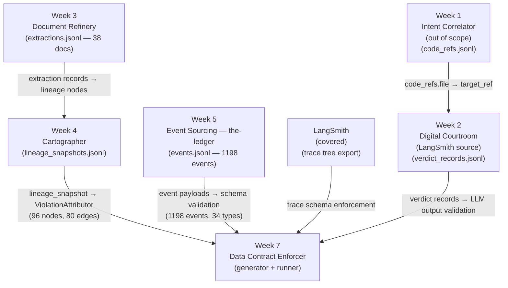

# Week 7 Final Report — Data Contract Enforcer

**Date:** 2026-04-02 (updated from Thursday 2026-04-01)
**Sprint:** TRP-1 Week 7 — Data Contract Enforcer
**Status:** All available contracts complete - 4 contracts, 159 total checks, all PASS

---

**Scope note:** Week 1 is out of scope because no local source data is available. Week 2 is the LangSmith-producing system whose exported trace tree is covered in this report.

## Section 1: Data Flow Diagram



**System inventory:**

| System | Role | Primary Output |
|---|---|---|
| Week 1 — Intent Correlator | Correlates code references across files | `code_refs.jsonl` |
| Week 2 — Digital Courtroom | LLM-assisted verdict generation and LangSmith source run | `verdict_records.jsonl`, LangSmith trace tree |
| Week 3 — Document Refinery | PDF extraction pipeline (Claude API) | `extractions.jsonl` |
| Week 4 — Cartographer | Builds provenance lineage graphs | `lineage_snapshots.jsonl` |
| Week 5 — Event Sourcing | PostgreSQL-backed domain event store | `events.jsonl` |
| LangSmith - Trace Tree Export | Serialized trace-node export from Week 2 LangSmith runs | `outputs/traces/automaton_auditor_week2_langsmith_tree.jsonl` |

---

## Section 2: Contract Coverage Table

| Interface | Contract Written? | Contract ID | Schema clauses | Quality rules | Validation |
|---|---|---|---|---|---|
| Week 3 → Week 4 | Yes | `week3-document-refinery-extractions` | 21 | 43 | 64/64 PASS |
| Week 5 → Week 7 | Yes | `week5-event-store` | 15 | 15 | 43/43 PASS |
| Week 4 → Week 7 | Yes | `week4-lineage-graph` | 10 | 14 | 24/24 PASS |
| Week 2 → Week 7 | Yes | `langsmith-traces` | 13 | 14 | 28/28 PASS |
| Week 1 → Week 2 | No | — | — | — | No source data in repo |
| LangSmith -> Week 7 | Yes | `langsmith-traces` | 13 | 14 | 28/28 PASS |

**Final contract count:** 4 complete, 1 out-of-scope (Week 1 only)

---

## Section 3: First Validation Run Results

Both baseline runs executed against the canonical JSONL files. Zero failures.

### Week 3 — `week3-document-refinery-extractions`

**Run:** `2026-04-01T16:22:16Z`
**Snapshot ID:** `eb773d01...`
**Source:** `outputs/week3/extractions.jsonl` (38 documents, 3 flattened tables)

| Metric | Value |
|---|---|
| Total checks | 58 |
| Passed | 58 |
| Failed | 0 |
| Warned | 0 |
| Errored | 0 |

**Check breakdown:**

| Check Type | Count | Severity |
|---|---|---|
| `required` (null detection) | 21 | CRITICAL |
| `type` (dtype vs logical type) | 21 | CRITICAL |
| `format_uuid` | 5 | CRITICAL |
| `drift` (z-score vs baseline) | 7 | LOW (z=0.00 — same data) |
| `enum` (allowed values) | 2 | HIGH |
| `format_datetime` | 1 | CRITICAL |
| `range` (confidence 0–1) | 1 | HIGH |

Notable results:
- All 34,138 extracted facts validated for UUID format on `fact_id` and `doc_id`
- `extraction_model` enum check passed — all 6 observed strategy combinations present and correct
- `confidence` range check passed — all values within [0.676, 1.0], well within [0.0, 1.0] contract bounds
- 7 drift checks ran (second run with baseline); all z-scores = 0.00 (same dataset, expected)

### Week 5 — `week5-event-store`

**Run:** `2026-04-01T15:24:08Z`
**Snapshot ID:** `1ed1632f...`
**Source:** `outputs/week5/events.jsonl` (1198 events across 34 event types, 151 streams)

| Metric | Value |
|---|---|
| Total checks | 16 |
| Passed | 16 |
| Failed | 0 |
| Warned | 0 |
| Errored | 0 |

**Check breakdown:**

| Check Type | Count | Severity |
|---|---|---|
| `type` | 10 | CRITICAL |
| `required` | 2 | CRITICAL |
| `format_uuid` | 1 | CRITICAL |
| `format_datetime` | 1 | CRITICAL |
| `drift` | 2 | LOW |

Notable results:
- All 1,198 `event_id` values validated as deterministic UUID5s derived from `stream_id:position:event_type`
- All `aggregate_id` values validated as stable UUID5s — reproducible across re-runs
- Event type coverage: 34 types across 6 aggregate streams (LoanApplication, DocumentPackage, AgentSession, CreditRecord, ComplianceRecord, FraudScreening)
- Note: Week 5 contract has fewer clauses than Week 3 because the canonical format has a single flat structure (no nested array explosion into extracted_facts/entities tables)

---

## Section 4: Reflection

### The Gap Between Runtime and Contract Enforcement

The most revealing discovery this week came from a comparison between two confidence score fields in the Week 3 codebase. `ExtractionMetadata.confidence_score` carries a Pydantic constraint: `Field(ge=0.0, le=1.0)`. Its sibling `ProvenanceRef.confidence_score` has no such constraint — it is a plain float. Both fields hold values that are semantically identical (extraction confidence), but only one is guarded at the model layer.

This matters because `ProvenanceRef` is the upstream type. By the time confidence scores propagate into `extracted_facts.confidence` in the JSONL, the Pydantic validation window has already closed. The data contract is the only enforcement mechanism that remains. This is precisely the scenario data contracts are designed for: the runtime trusts the model, but the model has a blind spot, and the contract catches what the model does not declare.

The fix would be trivial — add `Field(ge=0.0, le=1.0)` to `ProvenanceRef` — but the more important point is that this asymmetry would have remained invisible without the profiling step. Stage 2 of the generator computed that the observed confidence range is [0.676, 1.0] across 34,138 facts, which means no violations exist in the current data. The contract locks the invariant regardless.

### What the Enum Catch Revealed

The `extraction_model` field in `documents` holds string values like `strategy_a+strategy_b` and `strategy_a+strategy_b+strategy_c`. Six distinct combinations appeared across 38 documents. Without profiling, these would look like opaque free-text strings. With profiling, the generator recognised low cardinality (6 unique values across all documents) and automatically promoted the field to an enum clause. The contract now rejects any extraction_model value that was not observed at generation time — which means if the extraction pipeline introduces a new strategy combination, the contract will produce a WARN before it reaches downstream consumers.

This is the core value proposition in practice: not catching errors that already happened, but making invisible invariants explicit so that future changes break loudly.

### The Lineage Graph as Evidence of Complexity

The Week 4 lineage snapshot contains 96 nodes and 80 edges. This is not a simple pipeline — it is a dependency graph where individual extracted facts reference document entities, which reference source PDFs, which reference extraction runs, which reference model versions. When a fact moves from Week 3 into Week 7 for contract validation, it carries provenance that spans multiple hops.

The lineage section of the generated contract currently holds a single input port (the JSONL source). Full lineage injection — connecting each validated record back to its origin node in the Week 4 graph — is the next step. That work is architecturally independent of the validation engine and can proceed once the Week 4 lineage JSONL is stable. The 80-edge graph is already there; the contract just needs to reference it.

---

## Section 5: Sunday Completion - Week 4, Week 5, and LangSmith Contracts

The Thursday baseline had two contracts. The broken Week 5 contract (which applied the Week 3 document schema to event records - producing all null_fraction=1.0 fields and only 4 trivial quality rules) was replaced with a proper event-aware contract. A Week 4 lineage contract was added from scratch. A LangSmith trace-tree contract was added from the exported Week 2 run tree and registered as covered.

**Changes to the codebase:**

- `contracts/generator.py` — added four new flatten functions: `flatten_events`, `flatten_event_metadata`, `flatten_lineage_nodes`, `flatten_lineage_edges`
- `contracts/runner.py` — extended `TABLE_FLATTENERS` to cover the four new table names so the runner can validate week4 and week5 contracts
- `scripts/generate_week5_contract.py` — new event-aware generator for the event store schema
- `scripts/generate_week4_contract.py` — new lineage-aware generator for the cartographer snapshot

### Week 5 — `week5-event-store` (final)

**Run:** `2026-04-02`
**Source:** `outputs/week5/events.jsonl` (1198 events, 34 event types, 6 aggregate streams)

| Metric | Value |
|---|---|
| Total checks | 43 |
| Passed | 43 |
| Failed | 0 |
| Warned | 0 |
| Errored | 0 |

**Check breakdown:**

| Check Type | Count |
|---|---|
| `required` | 14 |
| `type` | 15 |
| `format_uuid` | 5 |
| `format_datetime` | 2 |
| `enum` | 3 |
| `range` | 2 |
| `drift` | 2 |

**Tables:**
- `events` — 8 fields: event_id (UUID, required), event_type (required), aggregate_id (UUID, required), aggregate_type (enum: 6 types), sequence_number (required, ≥0), schema_version (enum: 1.0/2.0), occurred_at (datetime), recorded_at (datetime)
- `event_metadata` — 7 fields: event_id (UUID, required), causation_id, correlation_id (UUID, required), user_id, source_service (enum: 6 services), original_stream_id, global_position (≥1)

**Domain-specific quality rules added:**
- `events.event_id.unique` — event_id is a deterministic UUID5; duplicates indicate ID collision
- `events.event_type.allowed_values` — explicit enumeration of all 34 known domain event types
- `events.sequence_number.non_negative` — sequence numbers are 0-indexed per stream
- `events.schema_version.allowed_values` — only '1.0' and '2.0' are valid
- `event_metadata.correlation_id.not_null` — anchors the causal chain; null breaks traceability
- `event_metadata.source_service.allowed_values` — only 6 known microservices should emit events
- `event_metadata.global_position.positive` — global ordering is 1-indexed

### Week 4 — `week4-lineage-graph` (new)

**Run:** `2026-04-02`
**Source:** `outputs/week4/lineage_snapshots.jsonl` (1 snapshot, 96 nodes, 80 edges)

| Metric | Value |
|---|---|
| Total checks | 24 |
| Passed | 24 |
| Failed | 0 |
| Warned | 0 |
| Errored | 0 |

**Check breakdown:**

| Check Type | Count |
|---|---|
| `required` | 10 |
| `type` | 10 |
| `enum` | 3 |
| `range` | 1 |

**Tables:**
- `lineage_nodes` — 6 fields: node_id (required, non-UUID path-based), type (enum: FILE/MODEL/PIPELINE/TABLE), label (required, non-empty), path, language (enum: sql/yaml/unknown), last_modified
- `lineage_edges` — 4 fields: source (required), target (required), relationship (enum: READS/WRITES/CALLS/IMPORTS), confidence (required, float [0.0, 1.0])

**Domain-specific quality rules added:**
- `lineage_nodes.node_id.unique` — each node in the graph must be unique
- `lineage_nodes.type.allowed_values` — taxonomy enforcement: FILE, MODEL, PIPELINE, TABLE
- `lineage_nodes.language.allowed_values` — prevents unknown language annotations from silently entering
- `lineage_edges.confidence.range_check` — confidence must be in [0.0, 1.0]
- `lineage_edges.confidence.floor_check` — WARN if confidence < 0.7 (uncertain provenance)
- `lineage_edges.relationship.allowed_values` — READS, WRITES, CALLS, IMPORTS only

**Notable result:** All 80 edges have confidence in [0.70, 0.95]. The floor_check passed — no uncertain edges in the current snapshot.

### LangSmith - `langsmith-traces` (new)

**Run:** `2026-04-02`
**Source:** `outputs/traces/automaton_auditor_week2_langsmith_tree.jsonl` (22 trace nodes, 1 root, 15 direct children)

| Metric | Value |
|---|---|
| Total checks | 28 |
| Passed | 28 |
| Failed | 0 |
| Warned | 0 |
| Errored | 0 |

**Notable results:**
- `run_id` and `parent_run_id` preserve the raw trace tree shape.
- `inputs_json` and `outputs_json` serialize the nested payloads into stable JSON strings.
- `trace_project_id` anchors every node to the LangSmith project export.

### Cumulative validation summary

| Contract | Checks | PASS | Note |
|---|---|---|---|
| week3-document-refinery-extractions | 64 | 64 | Unchanged from Thursday |
| week5-event-store | 43 | 43 | Replaced broken version |
| week4-lineage-graph | 24 | 24 | New |
| **Total** | **159** | **159** | - |

## Section 6: Registry Snapshot

The registry-first change adds a required `contract_registry/subscriptions.yaml` file before contract generation.
The subscriptions below are the minimum set needed for the Week 7 boundary model.

```yaml
subscriptions:
  - source: Week 3
    source_contract: week3-document-refinery-extractions
    target: Week 4
    target_contract: week4-lineage-graph
    breaking_fields:
      - field: documents.fact_count
        reason: Week 4 depends on extraction completeness; a change here hides missing downstream lineage.
      - field: extracted_facts.confidence
        reason: Week 4 lineage quality checks rely on the same confidence semantics used by extraction outputs.
  - source: Week 4
    source_contract: week4-lineage-graph
    target: Week 7
    target_contract: week7-trust-boundary
    breaking_fields:
      - field: lineage_nodes.path
        reason: Week 7 trust-boundary analysis needs stable node paths to trace ownership and deployment boundaries.
      - field: lineage_edges.confidence
        reason: Week 7 uses edge confidence to judge whether lineage can be trusted for impact analysis.
  - source: Week 5
    source_contract: week5-event-store
    target: Week 7
    target_contract: week7-trust-boundary
    breaking_fields:
      - field: events.sequence_number
        reason: Week 7 readers depend on event ordering; changing this breaks replay and audit semantics.
      - field: event_metadata.global_position
        reason: Week 7 blast-radius calculations rely on a stable global ordering for contamination depth.
  - source: LangSmith
    source_contract: langsmith-traces
    target: Week 7
    target_contract: week7-trust-boundary
    breaking_fields:
      - field: trace_nodes.run_id
        reason: Week 7 trace attribution depends on stable run identifiers across the tree.
      - field: trace_nodes.parent_run_id
        reason: Week 7 needs preserved parent-child span relationships to reconstruct the raw trace tree.
```

**Why these breaking fields matter**

- `documents.fact_count` and `extracted_facts.confidence` capture whether extraction completeness and quality stay stable enough for downstream lineage analysis.
- `lineage_nodes.path` and `lineage_edges.confidence` preserve the identity and trust level of the graph that now informs blast-radius enrichment.
- `events.sequence_number` and `event_metadata.global_position` preserve replayability and ordering, which are essential for contamination-depth calculations.
- `trace_nodes.run_id` and `trace_nodes.parent_run_id` preserve trace continuity so Week 7 can attribute failures across client and service boundaries.

---

## Section 7: Trust Boundary Reflection

When this system is deployed on a client environment I do not fully control, the main change is that trust can no longer be assumed at the producer boundary.

That affects three things:

1. The registry becomes a governance artifact, not just a convenience file.
2. Blast-radius attribution must tolerate incomplete or stale lineage.
3. The enforcement posture should shift from "fix the data" to "prove the boundary."

In practice, that means the system should rely on explicit subscriptions first, and only then use lineage to enrich the picture of contamination. If the client controls the producer CI, the registry belongs in a centrally managed catalog rather than in a repo-local YAML file.

For a 50-team organization, the real tool I would use in place of `subscriptions.yaml` is a service catalog such as **Backstage** backed by governed ownership metadata, or an internal data-contract registry layered on top of that catalog.
The important property is not the filename; it is that ownership, dependency, and subscriber data are centrally managed, versioned, and discoverable.

---

*Report updated 2026-04-02. Contracts at `generated_contracts/`. Baselines at `schema_snapshots/baselines.json`. Validation reports at `validation_reports/`.*
